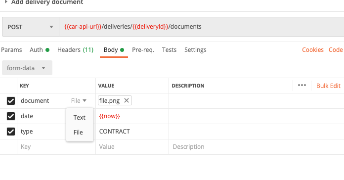

# Upload a delivery document

The endpoint to add a document uses the multipart/form-data format, which allows files to be sent together with the classic form data.

Firstly, it is crucial to send the header of the **Content-Type** : `multipart/form-data; boundary=<calculated>` the boundary is calculated by the browser or the HTTP library used.

Each part of the form is sent as follows:

- For files

```json
Content-Disposition: form-data; name="{NAME}"; filename="{FILE NAME}"[CRLF]
Content-Type: {MIME TYPE}[CRLF]
[CRLF]
{CONTENT}

```

- For classic data

```json
Content-Disposition: form-data; name="{NAME}"[CRLF]
[CRLF]
{VALUE}
```

The [CRLF] is equivalent to a line break "\r\n". The LAST NAME and FILE NAME must not contain quotation marks (") or a line break (\r or \n).

The data is separated by the boundary.

### Usage

**Postman**



**Javascript**

Native from browsers: [form-data](https://developer.mozilla.org/fr/docs/Web/API/FormData/FormData)

**NodeJs**

With the library: [form-data](https://www.npmjs.com/package/form-data)

**Java (Android)**

With [Retrofit](https://futurestud.io/tutorials/retrofit-2-how-to-upload-files-to-server)

**Java (SpringBoot)**

With [HttpClient](https://www.baeldung.com/httpclient-post-http-request#post-multipart-request)
