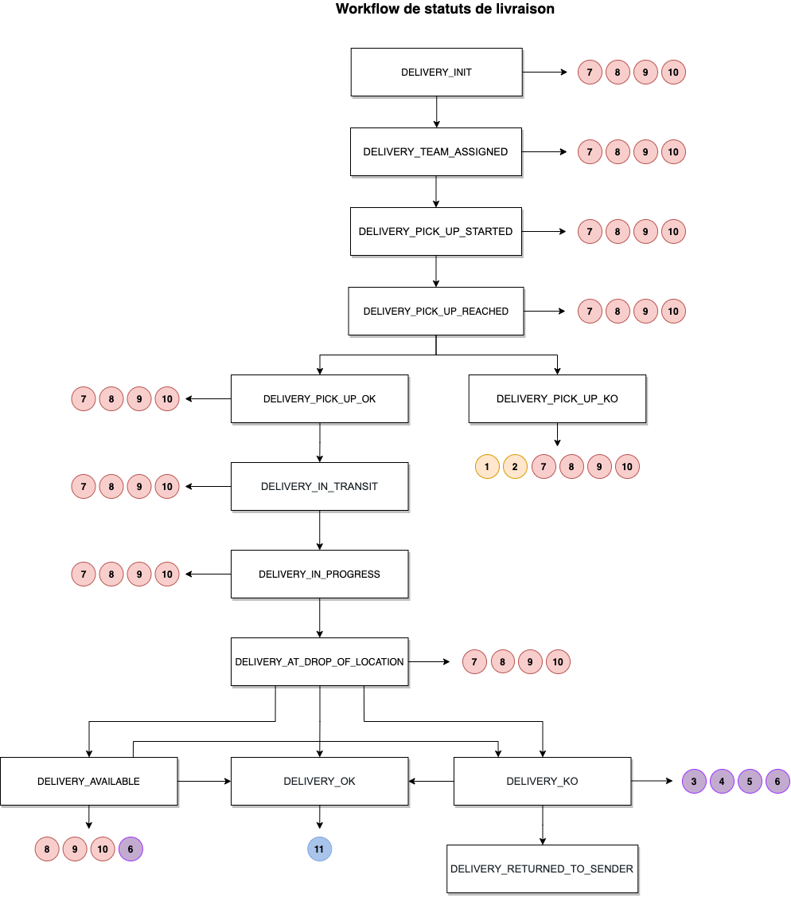

# Statuts de livraison

Au cours de son cycle de vie la commande passe tour à tour par plusieurs statuts. Ceux que nous identifions sont les différents stades de la livraison. 

### Parcours d'une commande

### Liste des statuts de livraison possible

Statut | Intitulé | Exemples de commentaire
---------|----------
 `DELIVERY_INIT`| Validée transporteur | "N/A"
 `DELIVERY_STARTED`| Coursier en approche magasin |  "N/A"
 `DELIVERY_PICK_UP_REACHED`| Coursier arrivé en magasin |  "N/A"
 `DELIVERY_PICK_UP_OK`| Commande prise en charge |  "N/A"
 `DELIVERY_PICK_UP_FAILED`| Commande en échec au retrait | "Impossible de prélever la marchandise: {raison}" Raison:  “La commande n’était pas prête” “Magasin fermé" “Aucun vendeur présent/disponible sur site pour récupérer la marchandise”
 `DELIVERY_PICK_UP_PARTIALLY`| Commande prise en charge partiellement | "L'ensemble de la commande n'a pu être prélevée que partiellement :  {liste raisons}“   Raisons:   “produit 1 ref XXXX  ne correspond pas à ce que le client a commandé”  “Produit 2 ref XXXX produit endommagé”  “Produit 3 ref XXXX produit manquant”
 `DELIVERY_IN_PROGRESS` | Commande en cours de livraison | "N/A"
 `DELIVERY_AT_DROP_OF_LOCATION` | Coursier arrivé client | "N/A"
 `DELIVERY_DELIVERED_OK` | Commande livrée conforme | "N/A"
 `DELIVERY_DELIVERED_WITH_CLAIM` | Commande livrée avec réserves | "Le client a acceptée la commande avec les réserves suivante: {commentaire client}"  Commentaire client: {champ libre contenant le retour du client}
 `DELIVERY_DELIVERED_PARTIALLY` | Commande prise en charge partiellement | "La commande n'a pu être livrée que partiellement :  {liste raisons}“   Raisons:   “produit 1 ref XXXX  ne correspond pas à ce que le client a commandé”   “Produit 2 ref XXXX produit endommagé”   “Produit 3 ref XXXX produit manquant”
 `DELIVERY_FAILED_WITH_RETURN` | Livraison en échec avec retour magasin | “Impossible de livrer: {liste raisons}”   Raisons:   “Le client était absent"   “Erreur dans l’adresse de livraison”, "Problème d'accessibilité"
 `DELIVERY_RETURNED_TO_PICK_UP` | Commande retournée en magasin | “Un ou plusieur produit ont étés retournés au point de prélèvement: {liste raisons}“ Raisons:   “Le client était absent"   “Erreur dans l’adresse de livraison”   "Problème d'accessibilité"   “produit 1 ref XXXX  ne correspond pas à ce que le client a commandé”   “Produit 2 ref XXXX produit endommagé”   “Produit 3 ref XXXX produit manquant”
 `DELIVERY_CANCELLED` | Livraison annulée | "Nos équipes ne sont plus en capacité d'effectuer cette livraison {raison}"   raison : "véhicule en panne”   “aucun livreur disponible”   “aucun véhicule disponible” 
 `DELIVERY_CANCELLED_WITH_RETURN` | Livraison annulée avec retour magasin | "Suite à un incident, nos équipes ont retourné la marchandise en magasin {raison}"   raison : "véhicule en panne”   “tournée non finalisée”
 `DELIVERY_BLOCKED` | Livraison bloquée | "La livraison est temporairement bloquée : {raison}"   Raison:  “Contrôle Douanier”  "Camion bloqué par une intempérie"  “Camion bloqué par la circulation”
 `DELIVERY_DELAYED` | Livraison retardée | "N/A"
 `DELIVERY_AVAILABLE` | Livraison disponible en point de retrait | "N/A"

### Gestion des retours et des erreurs

