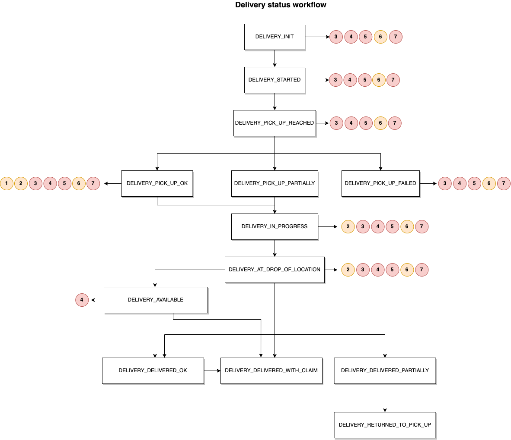
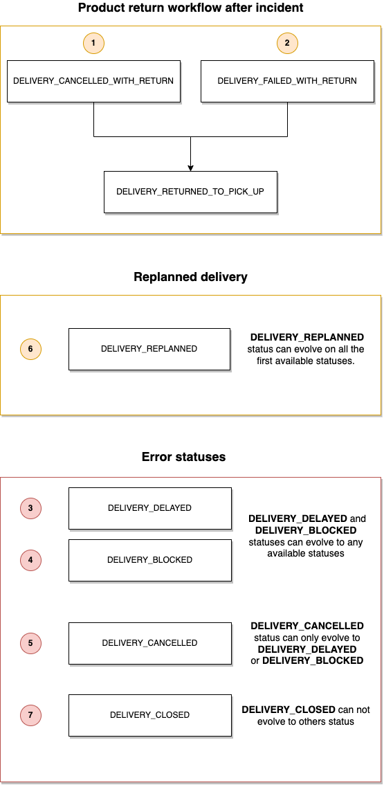

# Statuts de livraison

Au cours de son cycle de vie la commande passe tour à tour par plusieurs statuts. Ceux que nous identifions sont les différents stades de la livraison. 

### Parcours d'une commande

### Liste des statuts de livraison possible

Statut | Intitulé | Exemples de commentaire
---------|----------
 `DELIVERY_INIT`| Validée transporteur | "N/A"
 `DELIVERY_STARTED`| Coursier en approche magasin |  "N/A"
 `DELIVERY_PICK_UP_REACHED`| Coursier arrivé en magasin |  "N/A"
 `DELIVERY_PICK_UP_OK`| Commande prise en charge |  "N/A"
 `DELIVERY_PICK_UP_FAILED`| Commande en échec au retrait | “La commande n’était pas prête”   “Aucun vendeur présent/disponible sur site pour récupérer la marchandise”   "Colis manquants (certains transporteurs refusent les enlèvements partiels)"   "Emballage insuffisant (un défaut d'emballage sur un produit fragile peut être un motif de refus)"   "Lieu d'enlèvement inaccessible ou fermé"   "Temps d'attente excessif (contractuellement certains transporteurs peuvent refuser un enlèvement parce qu'ils ont attendu plus de x minutes)"
 `DELIVERY_PICK_UP_PARTIALLY`| Commande prise en charge partiellement | “produit 1 ref XXXX  ne correspond pas à ce que le client a commandé”  “Produit 2 ref XXXX produit endommagé”  “Produit 3 ref XXXX produit manquant”
 `DELIVERY_IN_PROGRESS` | Commande en cours de livraison | "N/A"
 `DELIVERY_AT_DROP_OF_LOCATION` | Coursier arrivé client | "N/A"
 `DELIVERY_DELIVERED_OK` | Commande livrée conforme | "N/A"
 `DELIVERY_DELIVERED_WITH_CLAIM` | Commande livrée avec réserves | "Le client a acceptée la commande avec les réserves suivante: {commentaire client}"
 `DELIVERY_DELIVERED_PARTIALLY` | Commande prise en charge partiellement | “produit 1 ref XXXX  ne correspond pas à ce que le client a commandé”   “Produit 2 ref XXXX est endommagé”   “Produit 3 ref XXXX produit manquant”   "Le client refuse la livraison du produit ref XXX (il peut avoir changé d'avis)"
 `DELIVERY_FAILED_WITH_RETURN` | Livraison en échec avec retour magasin | “Le client était absent"   “Erreur dans l’adresse de livraison”   "Problème d'accessibilité"   "Le Produit ne correspond pas à ce que le client a commandé"   "Le Produit est endommagé"   "Le client refuse la livraison (il peut avoir changé d'avis, certains ne vont pas chercher leur produit en point relais..)"
 `DELIVERY_RETURNED_TO_PICK_UP` | Commande retournée en magasin | “Le client était absent"   “Erreur dans l’adresse de livraison”   "Problème d'accessibilité"   “produit 1 ref XXXX  ne correspond pas à ce que le client a commandé”   “Produit 2 ref XXXX produit endommagé”   “Produit 3 ref XXXX produit manquant”
 `DELIVERY_CANCELLED` | Livraison annulée | "Nos équipes ne sont plus en capacité d'effectuer cette livraison {raison}"   raison : "véhicule en panne”   “aucun livreur disponible”   “aucun véhicule disponible” 
 `DELIVERY_CANCELLED_WITH_RETURN` | Livraison annulée avec retour magasin | "véhicule en panne”   “tournée non finalisée”
 `DELIVERY_BLOCKED` | Livraison bloquée | “Contrôle Douanier”  "Camion bloqué par une intempérie"  “Camion bloqué par la circulation”
 `DELIVERY_DELAYED` | Livraison retardée | “Contrôle Douanier”  "Camion bloqué par une intempérie"  “Camion bloqué par la circulation”
 `DELIVERY_AVAILABLE` | Livraison disponible en point de retrait | "N/A"
 `DELIVERY_REPLANNED`|Date de livraison replannifiée par une prise de RDV avec le client | "N/A" 

Les statuts `DELIVERY_PICK_UP_PARTIALLY` et `DELIVERY_DELIVERED_PARTIALLY` sont réservés à la livraison et ne sont pas autorisés pour le suivi de colis.

### Gestion des retours et des erreurs

